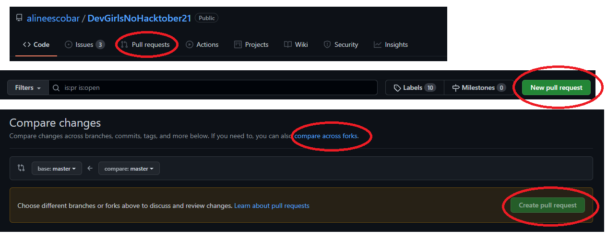
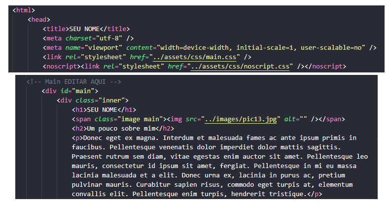
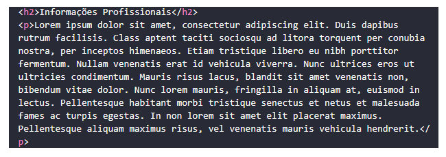
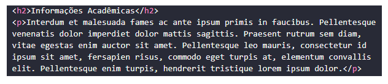
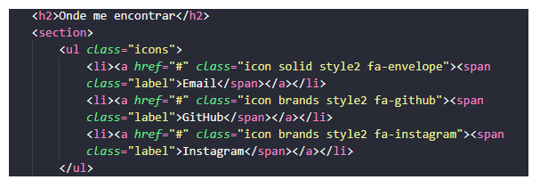

# DevGirlsnoHacktoberFest21

<h1 align="center">
<a><Logo-com-letras-laranja-fundo-preto></a>
</h1>
<h2 align="center">
O código aberto está mudando o mundo - uma contribuição de cada vez!
</h2>
 
=======
<!--ts-->

- [Sobre o HacktoberFest](#Sobre-o-HacktoberFest)
  - [O desafio](#O-Desafio)
- [Tecnologias](#Tecnologias)
- [As DevGirls](#As-DevGirls)
  - [Nosso Projeto](#Nosso-Projeto)
- [Como Participar](#Como-Participar)
  -[Como garantir os 4PRs em um só projeto?](Como-garantir-os-4PRs-em-um-só-projeto?)
- [Agradecimentos](#Agradecimentos)
- [Licença](#licença)
<!--te-->
=================

## Sobre o HacktoberFest

> Hacktoberfest é uma celebração de um mês de software de código aberto executado pela [DigitalOcean](https://www.digitalocean.com/).
> Durante o mês de outubro, convidamos você a se juntar a entusiastas de software de código aberto, iniciantes e à comunidade de desenvolvedores contribuindo para projetos de código aberto. Você pode fazer isso de várias maneiras:

>1. Prepare e compartilhe seu projeto para colaboração;
>2. Contribua para a melhoria de um projeto por meio de pull request;
>3. Organize um evento;
>4. Oriente outros;
>5. Doe diretamente para projetos de código aberto.

### O desafio

> Para incentivar a participação da comunidade nos projetos de código aberto(open source), a HacktoberFest ao longo desses 8 anos, vem oferencendo como brinde a possibilidade de escolha entre uma camiseta de edição limitada ou o plantio de uma árvore. Não é fantástico?!
> Basta completar, durante o mês de Outubro, o envio de 4 Pull Requests, em repositórios sinalizados/habilitados a participar do evento. Completou as 4 solicitações, você escolhe um dos brindes. Mas, é preciso correr logo se você quiser escolher a camiseta, por que são apenas 50 mil!
> Ah, é muito importante está inscrito no evento e está logado durante o envio das PRs.
> Participe e seja mais uma contribuidore na comunidade Open Source!

> Saiba mais e inscreva-se em: [HacktoberFest2021](https://hacktoberfest.digitalocean.com/).

## Tecnologias

> Este projeto foi desenvolvido com as seguintes tecnologias:

>1. [Html](https://developer.mozilla.org/pt-BR/docs/Learn/Getting_started_with_the_web/HTML_basics);
>2. [CSS](https://developer.mozilla.org/pt-BR/docs/Web/CSS);
>3. [SCSS](https://en.wikipedia.org/wiki/Source_Code_Control_System);
>4. [JavaScript](https://developer.mozilla.org/pt-BR/docs/Web/JavaScript).

## As DevGirls

> A Dev Girls surgiu em dezembro de 2019, unindo Node Girls e Dev JavaGirls. Fizemos alguns encontros presenciais e quando iniciou a pandemia, passamos a nos encontrar mensalmente online. Em junho de 2021 a "Oxe, é node!" se uniu à comunidade e hoje somos 8 mulheres na organização.
> O grupo é exclusivo para todas as mulheres (cis, trans e não binárias).
> Temos os encontros mensais no zoom, com talks conduzidas pelas mulheres da comunidade ou colaboradoras das empresas parceiras do meetup.
> Estamos presentes nas seguintes redes: Discord(Local onde trocamos informações sobre vagas, divulgamos outros eventos, conversamos sobre Mulheres na Tecnologia e incentivamos outras Mulheres), Linkedin(Nosso perfil profissional), Instagram(Local mais informal para divulgação dos eventos e postagens comemorativas) e mais recentemente o Github da comunidade.

> Antes de chegar no projeto, dá uma olhada se você já conhece nossas redes. Se não, aproveita e nos segue. Caso queira entrar na comunidade do Discord, fala conosco que te enviamos o convite ;)

<h3 align="center">
  
  
  
  
### Nosso Projeto

> Este ano, reafirmando nosso incentivo à participação das Mulheres no mundo da tecnologia, decidimos criar este projeto, que consiste em criar a página do pefil des membres de nossa comunidade. Cada uma poderá preencher seu perfil como informações, pessoais, profissionais, acadêmicas, seus contatos e criar um card com imagem para que possamos divulgar ainda mais mulheres e suas histórias, no mundo tech.

## Como participar

> Para participar basta seguir os passos:
>
> 1. Faça o fork deste repositório;
> 2. Clone em sua máquina;
> 3. Faça uma cópia do arquivo, em (.html), que consta na pasta (paginas-perfil);
> 4. Renomei o arquivo com o seu nome, obedecendo o seguinte formato: (perfil-nome.html);
> 5. Faça as modificações nos campos solicitados.

> Para criar o perfil no index, é preciso: A. Adiconar sua foto na pasta (images); B. Preencher o card que se encontra no arquivo(index.html). Não esqueça de observar que é necessário, copiar o card modelo e prencher um novo com os seus dados. Lembre-se de adicionar sua imagem de perfil na pasta images. Nomei sua foto com o seguinte formato (perfil-nome.jpeg/jpg/png).
>Caso tenha qualquer dúvida, basta sinalizar na nossa comunidade no Discord, que as Organizadores DevGirls estarão dispostas a ajudar e elucidar qualquer questão!

### Como garantir os 4PRs em um só projeto? 

> Nosso repositório possue a possibilidade de envio de 5 PRs.
> Siga a sequência de dados solicitados para criação do seu perfil DevGirl. Lembre-se de ler os comentários que estão nos arquivos, eles te ajudarão a se guiar. 

> Antes de tudo, vamos mostrar o passo a passo de como abrir uma PR. Após fazer suas modificações e seguir os passos de add -> commit -> push. Vá no repositório e clique em Pull requests, logo abaixo do nome do repositório. Em seguida abrirá uma outra gia que mostrará a opção "New pull request", clique. Compare as mudanças, clicque em "compare across forks". Esse passo é super importante, você vai comparar o que foi feito na sua master com a master do repositório, aqui você verá se tem algum conflito. Feito isso, só clicar em "create pull request". Observer na imagem a seguir.

<h3 align="center">
<a><imagem-código-html></a>
</h3>

> Primeiro: Preencha seu nome e a seção "Um pouco sobre mim". Após preencher salve, suba para o repositório e abra sua primeira PR.

<h3 align="center">
<a><imagem-código-html></a>
</h3>

> Foi aprovada? Vamos à segunda. Agora preencha o campo "Informações profissionais". Repita o mesmo passo feito na primeira.

<h3 align="center">
<a><imagem-código-html></a>
</h3>

> Simbora para a 3ª PR? Agora preencha suas "Informações Acadêmicas". Repetiu o passo a passo das anteiores? Estamos chegando ao final.

<h3 align="center">
<a><imagem-código-html></a>
</h3>

> Última PR, preencha o campo "Onde me encontrar", nele você colocará seus contatos. Pronto! Você garantiu as 4 PRs. Mas, para seu perfil ficar pronto, não esqueça de preencher o arquivo index.html. E já sabe, abre outra PR pra nós. 

<h3 align="center">
<a><imagem-código-html></a>
</h3>

> O desafio pede 4 PRs, mas quanto mais você fizer, melhor. Este é apenas o começo para o mundo das contribuições opensource. 

> Lembrando que para garantir o mimo dado pela organização do evento, faz-se necessário ter os 4 pull requests, mergeados/aprovados até o fim de outubro. 

### Agradecimentos

> Agradecemos à todes que quiseram participar e contribuir com este projeto. Que seja o primeiro de muitos e que possamos divulgar e contribuir com a inserção de mais mulheres no mundo da tecnologia. Juntes somos mais fortes!!

### Licença

<left><Logo-cc-letras-pretas-fundo-branco></left>[CreativeCommons](http://creativecommons.org/licenses/by/3.0/)

